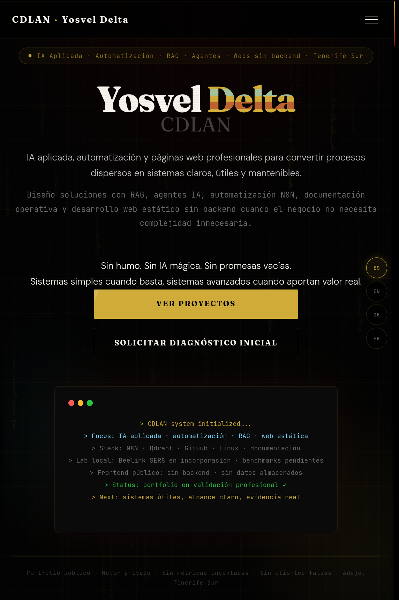
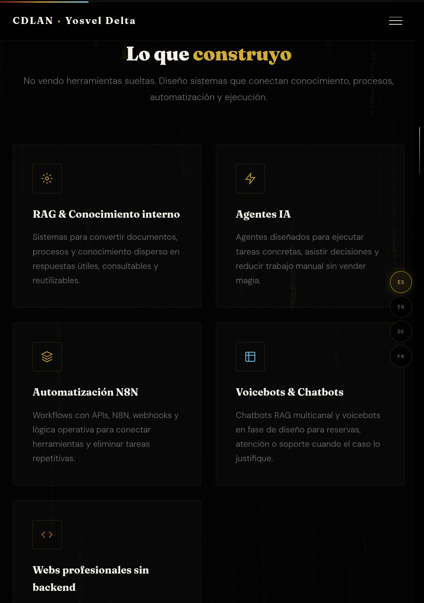
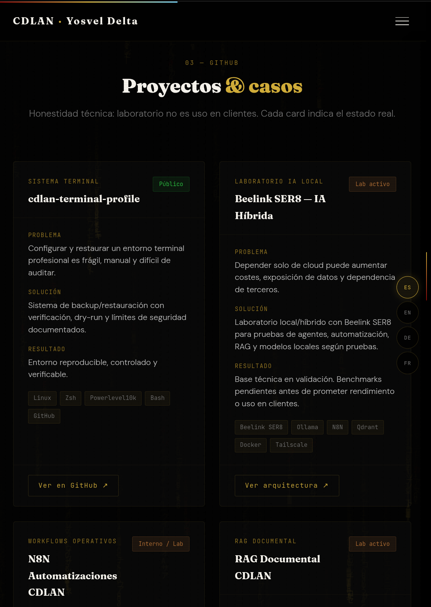
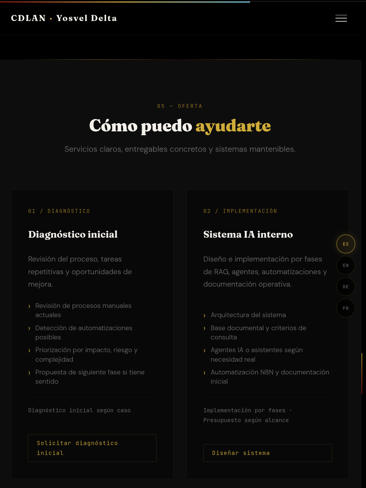
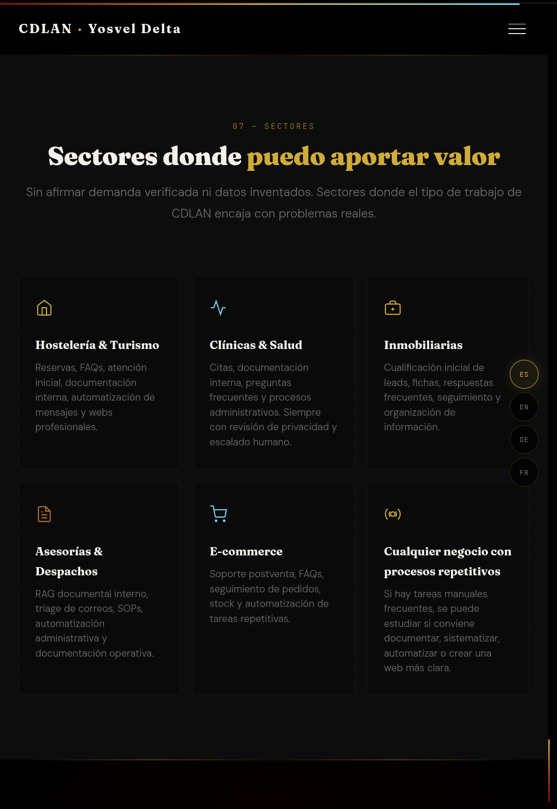
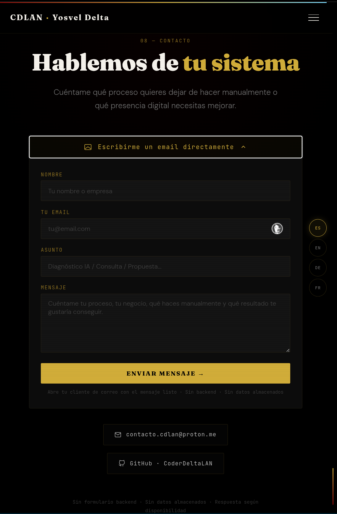

  

<h1 align="center">CDLAN Portfolio</h1>

  <strong>Public professional portfolio for CDLAN / Yosvel Delta: applied AI, automation, RAG, agents, operational systems and static web presence.</strong>

  
  
  
  
  
  

  
  
  
  

  <a href="https://coderdeltalan.github.io/cdlan-portfolio/">Live Site</a>
  ·
  <a href="#screenshots">Screenshots</a>
  ·
  <a href="#overview">Overview</a>
  ·
  <a href="#quality-gates">Quality Gates</a>
  ·
  <a href="#public-private-boundary">Public / Private Boundary</a>
  ·
  <a href="#maintainer-workflow">Maintainer Workflow</a>

---

## Live Site

The portfolio is published with GitHub Pages:

https://coderdeltalan.github.io/cdlan-portfolio/

Verified publication state:

- GitHub Pages enabled;
- source branch: `main`;
- source path: `/`;
- public URL responding with HTTP 200;
- HTTPS enforced;
- published title verified;
- README screenshots curated from the live site.

---

## Screenshots

### Hero / public identity

  

### Systems and services

  

### Projects and technical evidence

  

### Offer

  

### Business sectors

  

### Contact

  

---

## Overview

`cdlan-portfolio` is the public web presence for CDLAN / Yosvel Delta.

It is designed to present a sober, premium and technically credible profile around:

- applied AI systems;
- process diagnosis;
- RAG and document intelligence;
- AI agents and assistants with clear boundaries;
- N8N automation and workflow design;
- operational documentation;
- static professional websites without backend;
- local and hybrid AI lab work;
- maintainable systems for businesses, professionals and local establishments.

The site is intentionally static.

It does not include:

- backend services;
- database storage;
- analytics tracking;
- hidden API calls;
- customer data;
- private prompts;
- real N8N workflow exports;
- SaaS internals;
- unsupported claims.

The portfolio is not meant to sell magic. It is meant to show a clear professional standard: useful systems, documented boundaries, public evidence and restrained claims.

---

## What This Project Demonstrates

This repository demonstrates more than a visual landing page.

It shows:

- a complete public portfolio built from scratch;
- GitHub Pages publication from `main`;
- a premium black / gold / red visual direction;
- multilingual frontend behavior;
- a contact flow without backend storage;
- Schema.org JSON-LD metadata;
- SEO metadata baseline;
- Open Graph and Twitter card metadata;
- frontend Content Security Policy metadata;
- explicit public/private boundary;
- local verification gates;
- GitHub Actions verification;
- pull-request based delivery;
- disciplined Always-Green workflow.

This is a public frontend repository, not the private operational backend of CDLAN.

---

## Services Represented

CDLAN focuses on practical, bounded implementation:

- AI diagnosis and process review;
- internal RAG systems;
- AI agents and assistants;
- N8N automations;
- workflow documentation;
- operational SOPs;
- static professional websites;
- maintenance and continuous improvement.

The site avoids inflated language, invented metrics and unsupported guarantees.

Current claim policy:

- no fake clients;
- no fake production deployments;
- no invented ROI;
- no inflated authority claims;
- no unsupported availability or performance promises;
- no hidden compliance claims;
- no confidential project exposure.

---

## Repository Layout

    .
    ├── .github/
    │   └── workflows/
    │       └── verify.yml
    ├── assets/
    │   ├── css/
    │   │   └── styles.css
    │   └── js/
    │       └── main.js
    ├── docs/
    │   ├── CONTENT-GUIDE.md
    │   ├── GITHUB-PAGES-PUBLICATION.md
    │   ├── LANDING-AUDIT-CHECKLIST.md
    │   ├── PORTFOLIO-ROADMAP.md
    │   ├── PUBLICATION-CHECKLIST.md
    │   ├── REPOSITORY-GOVERNANCE.md
    │   └── screenshots/
    │       └── readme/
    │           ├── portfolio-contact.png
    │           ├── portfolio-hero.png
    │           ├── portfolio-offer.png
    │           ├── portfolio-projects.png
    │           ├── portfolio-sectors.png
    │           └── portfolio-services.png
    ├── index.html
    ├── scripts/
    │   └── verify.sh
    ├── LICENSE
    ├── SECURITY.md
    ├── README.md
    └── .nojekyll

---

## Quality Gates

The local verification suite checks:

- required repository files;
- absence of generated/vendor artifacts;
- CRLF line endings;
- trailing whitespace;
- obvious sensitive patterns in publishable files;
- basic HTML parse markers;
- SEO and security metadata;
- accessibility baseline;
- structural integrity;
- workflow trigger coverage.

The structural integrity check validates:

- exactly one `<title>`;
- exactly one `<h1>`;
- valid JSON-LD;
- no duplicate IDs;
- no broken internal anchors;
- blocked risky claims not present.

Expected healthy result:

    == final result ==
    [OK] verification passed

Run locally with:

    bash scripts/verify.sh

---

## SEO / Metadata Baseline

The published page includes:

- canonical URL;
- robots metadata;
- author metadata;
- Open Graph title, description, type and URL;
- Twitter card metadata;
- theme color;
- dark color scheme;
- JSON-LD structured data.

The repository verifies these markers so future changes do not silently degrade the public page.

---

## Security Boundary

This is a static public website.

Security model:

- no backend;
- no database;
- no stored form submissions;
- no public API keys;
- no workflow exports;
- no SaaS internals;
- no customer material;
- no private prompts;
- no secrets in repository files.

The contact form opens the user's email client. It does not submit to a server.

The site contains frontend security metadata, but real HTTP security headers are limited by the GitHub Pages hosting model. The repository therefore avoids claiming server-side security controls it does not own.

---

## Accessibility Baseline

The repository verifies a minimum accessibility baseline:

- explicit labels for contact form fields;
- reduced-motion media query;
- custom cursor fallback for touch / coarse pointer devices;
- one primary `<h1>`;
- valid internal anchors.

This is not a full WCAG certification. It is a practical baseline to prevent obvious regressions.

---

## Publication Status

Current status:

- public repository;
- GitHub Pages enabled;
- source: `main` / root;
- URL responding with HTTP 200;
- HTTPS enforced;
- final landing page integrated;
- publication status documented;
- README screenshots curated from the live site.

Publication reference:

- `docs/GITHUB-PAGES-PUBLICATION.md`
- `docs/PUBLICATION-CHECKLIST.md`
- `docs/LANDING-AUDIT-CHECKLIST.md`

---

## Public / Private Boundary

Allowed in this repository:

- public brand presentation;
- portfolio content;
- service descriptions;
- static frontend code;
- public contact information;
- public documentation;
- curated screenshots;
- non-sensitive project summaries.

Not allowed in this repository:

- secrets;
- API keys;
- tokens;
- private prompts;
- real workflow exports;
- backend internals;
- SaaS internals;
- customer data;
- private commercial strategy;
- private logs;
- credentials;
- unsupported claims.

---

## Maintainer Workflow

This repository follows an Always-Green workflow.

Required discipline:

- never work directly on `main`;
- start each phase from clean, synchronized `main`;
- read real files before editing;
- make one logical change per branch;
- avoid `git add .`;
- stage only expected files;
- inspect staged diff before commit;
- run local checks before push;
- verify the push exists and remote SHA matches local HEAD;
- verify CI is green for the exact branch or PR head SHA;
- open PR only after push validation;
- merge only after PR CI is green;
- use squash merge;
- verify `main` after merge;
- delete local and remote phase branches;
- finish only when `main` is clean, synchronized and green.

A change is not considered complete until:

    main is clean
    origin/main is synchronized
    scripts/verify.sh passes
    CI is green
    phase branches are removed

---

## Development Notes

This repository is intentionally simple.

There is no build step required for publication. GitHub Pages serves the root `index.html`.

Current implementation style:

- single public landing page;
- static HTML/CSS/JavaScript;
- external fonts;
- GSAP animation scripts;
- no bundler;
- no backend;
- no package manager lockfile;
- no generated build directory.

If the project later grows into a larger frontend app, that should happen in a separate phase with explicit architecture review.

---

## Related Documentation

- `docs/CONTENT-GUIDE.md`
- `docs/GITHUB-PAGES-PUBLICATION.md`
- `docs/LANDING-AUDIT-CHECKLIST.md`
- `docs/PORTFOLIO-ROADMAP.md`
- `docs/PUBLICATION-CHECKLIST.md`
- `docs/REPOSITORY-GOVERNANCE.md`
- `SECURITY.md`
- `LICENSE`

---

## Project Status

Current status:

- final landing page integrated;
- public URL live;
- GitHub Pages built;
- HTTP 200 verified;
- SEO/security metadata checks active;
- accessibility baseline checks active;
- structural verification checks active;
- README screenshots added;
- repository governance documented;
- source-available license in place;
- backend remains out of scope.

---

## License

Source-available, all rights reserved.

This repository is public for review as part of the CDLAN professional web presence. It is not open-source software unless a later commit explicitly states otherwise.

See `LICENSE`.

---

## Scope Disclaimer

This repository is tailored to the public CDLAN portfolio.

It is published as a professional reference for static web presence, public positioning and disciplined repository workflow. It is not a reusable SaaS backend, not a client delivery package, and not a template that should be copied without review.

---

  <strong>CDLAN · Less noise. More system.</strong>

  

